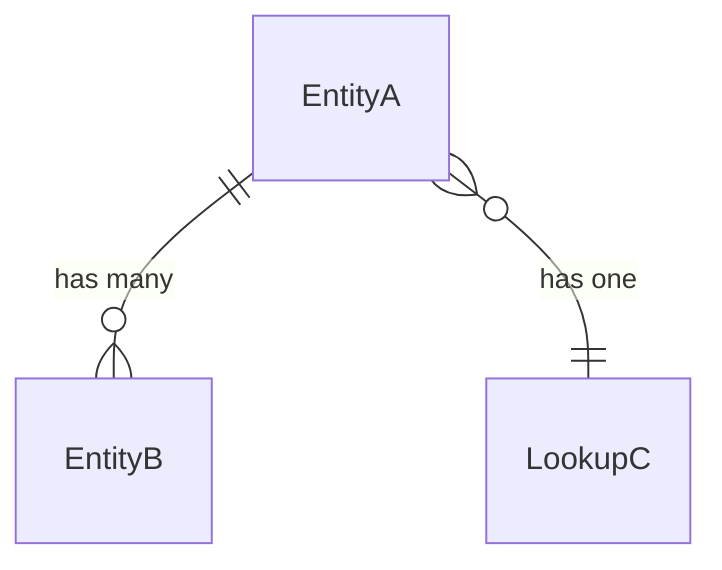

# Assignment Implementation Playbook

> **Purpose**: This document is the canonical guide for implementing any new business domain on top of the backend scaffold. Every assignment implementation must follow this playbook in order, without skipping phases.

---

## Quick Reference: Dependency Rules

```
HTTP Request
      │
      ▼
Middleware Pipeline (15 stages — DO NOT MODIFY)
      │
      ▼
Controller          ← thin: validate, delegate, return envelope
      │
      ▼
Orchestrator        ← coordinates workflows, manages transactions
      │
      ▼
Services            ← single-capability business logic
      │
      ▼
Repositories        ← persistence only, no business logic
      │
      ▼
Database Models     ← data shape only, no logic
```

| Layer | Can access | Cannot access |
|---|---|---|
| Controller | Orchestrator | Repositories, Services, Models |
| Orchestrator | Services, UnitOfWork | Repositories directly, Models |
| Service | Repository Interfaces | Other Services*, Models |
| Repository | DB Model | Services, Orchestrators, UoW |
| Model | Nothing | Anything |

> \* A service may call another service only when there is no alternative and it introduces no circular dependency.

---

## Phase 1 — Requirement Analysis

Before writing **any** code, extract the following from the assignment specification:

### 1.1 Functional Requirements
- List every capability the system must expose (verbs + nouns).
- Map each capability to an API endpoint.

### 1.2 Non-Functional Requirements
- Performance SLAs (response times, throughput)
- Availability requirements
- Security requirements (auth, authz, encryption)
- Audit requirements
- Data retention requirements

### 1.3 Actors
- Who are the users of this system?
- What roles do they hold?
- What can each role do?

```
Example:
Actor         | Role    | Can do
-----------------------------------------------
Admin User    | ADMIN   | Full CRUD on all entities
Standard User | USER    | CRUD on own entities only
Guest         | —       | Read-only, unauthenticated
```

### 1.4 Entities & Relationships
- List all entities.
- Identify relationships (one-to-one, one-to-many, many-to-many).
- Identify which entities are lookup tables.
- Identify ownership (which entity owns which).

### 1.5 Business Rules
- Extract every explicit and implicit rule from the specification.
- Number each rule (BR-001, BR-002...) for traceability.

### 1.6 Edge Cases & Failure Cases
- What happens when a referenced entity does not exist?
- What happens on duplicate creation?
- What happens on concurrent modification?
- What happens on partial failure in a transaction?

### 1.7 Validation Rules
- Field-level constraints (required, type, length, format, range)
- Cross-field constraints
- Business-level constraints (e.g., status machine transitions)

---

## Phase 2 — Domain Modeling

Produce a normalized data model before writing any code.

### 2.1 Entity Table

| Entity | Type | Description | Owner | Soft Delete | Audited |
|---|---|---|---|---|---|
| `EntityA` | Primary | ... | TenantId | Yes | Yes |
| `LookupB` | Lookup | ... | — | No | No |

### 2.2 Field Definitions (per entity)

```
Entity: {EntityName}
┌─────────────────┬──────────────┬──────────┬──────────────────────────────┐
│ Field           │ Type         │ Required │ Notes                        │
├─────────────────┼──────────────┼──────────┼──────────────────────────────┤
│ id              │ UUID         │ Yes      │ Internal PK — never exposed  │
│ urn             │ string       │ Yes      │ External identifier          │
│ ...             │ ...          │ ...      │ ...                          │
│ is_deleted      │ boolean      │ Yes      │ Soft delete flag             │
│ created_at      │ timestamp    │ Yes      │ Auto                         │
│ updated_at      │ timestamp    │ Yes      │ Auto                         │
└─────────────────┴──────────────┴──────────┴──────────────────────────────┘
```

### 2.3 ER Diagram

Document entity relationships using a mermaid ER diagram in `docs/{domain}/ER_DIAGRAM.md`.



### 2.4 Lifecycle Diagram

If entities have status transitions, document the state machine:

```
DRAFT → ACTIVE → ARCHIVED
  ↑        |
  └── restore (soft-delete recovery)
```

---

## Phase 3 — API Design

Design every API **before** implementation. Do not write code until the contract is clear.

### 3.1 API Contract Template

```
Endpoint:       POST /api/v1/{resource}
Authentication: Bearer JWT
Authorization:  Roles: [USER, ADMIN]
Idempotency:    Idempotency-Key header (optional)
Rate Limit:     Inherits platform default (100 req/min)
Transaction:    Yes — full UoW boundary

Request Body:
  {
    "field": "value"
  }

Validation:
  - field: required, string, 1–255 chars

Success Response: 201
  {
    "transactionUrn": "...",
    "status": "SUCCESS",
    "responseKey": "RESOURCE_CREATED",
    "data": { ... }
  }

Error Responses:
  400 — Validation failure
  401 — Unauthenticated
  403 — Unauthorized / insufficient role
  404 — Entity not found
  409 — Conflict (duplicate)
  429 — Rate limited
  500 — Internal error
```

### 3.2 Required Endpoints per Resource

For every primary entity, implement:

| Verb | Route | Description |
|---|---|---|
| `POST` | `/api/v1/{resource}` | Create |
| `GET` | `/api/v1/{resource}` | List (paginated, sorted, filtered) |
| `GET` | `/api/v1/{resource}/:urn` | Get by URN |
| `PUT` | `/api/v1/{resource}/:urn` | Update |
| `DELETE` | `/api/v1/{resource}/:urn` | Soft delete |
| `POST` | `/api/v1/{resource}/:urn/restore` | Restore |

Add domain-specific endpoints as required.

---

## Phase 4 — File Structure

Every new domain module follows this strict structure:

```
src/
├── models/
│   ├── {entity}.ts                      ← IEntityModel interface + EntityModel class
│   └── {lookup}.ts                      ← ILookupModel extension
│
├── dto/
│   ├── controller/
│   │   ├── requests/{entity}.ts         ← Request DTOs with Zod schemas
│   │   └── responses/{entity}.ts        ← Response DTOs
│   └── services/{entity}.ts             ← Internal service DTOs (if needed)
│
├── repositories/
│   ├── {entity}.ts                      ← IEntityRepository + EntityRepository
│   └── lookups/{lookup}.ts              ← CachedLookupRepository
│
├── services/
│   ├── interfaces/{entity}.ts           ← IEntityService interface
│   ├── interfaces/{lookup}.ts           ← ILookupService interface
│   ├── {entity}.ts                      ← EntityService implementation
│   ├── {lookup}.ts                      ← LookupService implementation
│   └── orchestrators/{entity}.ts        ← EntityOrchestrator
│
├── controllers/
│   ├── routes.ts                        ← Root router (mounts '/api')
│   └── api/
│       ├── routes.ts                    ← API router (mounts '/v1')
│       └── v1/
│           ├── routes.ts                ← V1 router (mounts feature routers '/auth', '/products')
│           ├── auth/
│           │   ├── routes.ts            ← Feature router (maps POST '/register', POST '/login')
│           │   ├── create.ts
│           │   └── login.ts
│           └── products/
│               ├── routes.ts            ← Feature router (maps GET '/fetch', POST '/create')
│               ├── fetch.ts
│               └── create.ts
│
├── dependencies/
│   └── container.ts                     ← Add DI_TOKENS for new domain
│   └── index.ts                         ← Wire all new factories
│
└── utilities/
    └── specifications/                  ← Add domain-specific specifications (optional)
```

---

## Phase 5 — Repository Implementation Rules

```typescript
// ✅ Correct: Interface first
export interface IEntityRepository extends IBaseRepository<IEntityModel, string> {
  findByOwner(ownerId: string): Promise<IEntityModel[]>;
  search(criteria: ISearchCriteria): Promise<IQueryResult<IEntityModel>>;
}

// ✅ Correct: Implementation extends BaseRepository
export class EntityRepository
  extends BaseRepository<any, IEntityModel, string>
  implements IEntityRepository {

  constructor(dbModel: any) { super(dbModel); }

  // Custom finder — builds criteria, calls inherited findOne/findPaginated
  public async findByOwner(...) { ... }

  // Required abstract implementations
  protected mapToEntity(model: any): IEntityModel { ... }
  protected mapToModel(entity: Partial<IEntityModel>): any { ... }
}
```

### Repository Rules (must not violate)

- ❌ No `this.unitOfWork.commit()` inside a repository
- ❌ No `this.unitOfWork.rollback()` inside a repository
- ❌ No business rules (e.g., "if status is X, then...")
- ❌ No calls to other repositories
- ❌ No calls to services
- ✅ Lookup repositories must extend `GenericLookupRepository` or implement cache-first reads manually
- ✅ `mapToEntity` must map snake_case DB fields to camelCase interface fields
- ✅ `mapToModel` must map camelCase back to snake_case

---

## Phase 6 — Service Implementation Rules

```typescript
// ✅ Interface first
export interface IEntityService {
  getByUrn(urn: string): Promise<EntityResponseDTO>;
  create(data: CreateEntityInput, ownerId: string): Promise<EntityResponseDTO>;
  update(urn: string, ownerId: string, data: UpdateEntityInput): Promise<EntityResponseDTO>;
  softDelete(urn: string, ownerId: string): Promise<void>;
}

// ✅ Implementation extends BaseService
export class EntityService extends BaseService implements IEntityService {
  constructor(private readonly entityRepository: IEntityRepository) { super(); }

  public async create(...): Promise<EntityResponseDTO> {
    this.logger.info(`Creating entity for owner: ${ownerId}`);
    // validate uniqueness → call repository → map to DTO → return
  }
}
```

### Service Rules (must not violate)

- ❌ No direct model access — only through repository interface
- ❌ No `unitOfWork.commit()` or `unitOfWork.rollback()`
- ❌ No HTTP request/response objects
- ❌ No controller logic
- ✅ Single capability per method
- ✅ Throw typed exceptions (`NotFoundException`, `ConflictException`, etc.)
- ✅ Always log activity via `this.logger`
- ✅ Use `@MeasurePerformance('service')` on public methods

---

## Phase 7 — Orchestrator Implementation Rules

```typescript
export class EntityOrchestrator extends BaseOrchestrator implements IEntityOrchestrator {
  constructor(
    unitOfWork: IUnitOfWork,
    private readonly entityService: IEntityService,
    private readonly lookupService: ILookupService
  ) { super(unitOfWork); }

  public async createEntity(input: CreateInput, ownerId: string): Promise<EntityResponseDTO> {
    // 1. Read-only lookups BEFORE transaction (no UoW needed)
    const isValidStatus = await this.lookupService.isValid(input.statusCode);
    if (!isValidStatus) throw new BadRequestException('Invalid status');

    // 2. Execute transactional work inside executeInTransaction
    return this.executeInTransaction(async () => {
      const entity = await this.entityService.create(input, ownerId);
      // optionally call other services in same transaction
      return entity;
    }, 'EntityOrchestrator.createEntity');
  }
}
```

### Orchestrator Rules (must not violate)

- ❌ No direct repository access
- ❌ No business logic (no if/else business rules)
- ❌ No model access
- ✅ All write operations must be inside `executeInTransaction()`
- ✅ Read-only lookups before transaction (cheaper)
- ✅ One orchestrator per use case (Create, Update, Delete, etc. may share one orchestrator)
- ✅ Emit events via `EventBusUtility.publish()` after commit
- ✅ Use `@MeasurePerformance('orchestrator')` on public methods

---

## Phase 8 — Controller Implementation Rules

```typescript
export class CreateEntityController extends BaseController {
  constructor(private readonly orchestrator: IEntityOrchestrator) { super(); }

  public async handle(req: IHttpRequest<CreateEntityInput>): Promise<IHttpResponse> {
    // 1. Validation has ALREADY occurred at Stage 13 (RequestValidationMiddleware).
    // req.body is already validated against the Zod schema associated with this route.

    // 2. Extract identity from request context (never trust body inputs for identity)
    const ownerId = req.context?.userId ?? 'anonymous';

    // 3. Delegate execution directly to orchestrator
    const result = await this.orchestrator.createEntity(req.body, ownerId);

    // 4. Return standardized response envelope
    return this.created(result, 'Entity created successfully', 'ENTITY_CREATED', req.context);
  }
}
```

### Controller Rules (must not violate)

- ❌ No business logic
- ❌ No repository access
- ❌ No service access
- ❌ No model access
- ❌ Never expose internal `id` — always use `urn`
- ❌ No manual validation inside `handle()` — validation is performed upstream by `RequestValidationMiddleware`
- ✅ Extract `userId` and `tenantId` from `req.context` (set by upstream auth & tenant middlewares)
- ✅ Return standard response envelopes: `this.success()`, `this.created()`, `this.envelope()`
- ✅ Register route & request DTO schema in `RouteRegistry` so `RequestValidationMiddleware` and API docs automatically pick it up

---

## Phase 9 — DI Registration

Every domain must register its dependencies in the container.

### 9.1 Add DI Tokens to `src/dependencies/container.ts`

```typescript
export const DI_TOKENS = {
  // ... existing tokens ...

  // Repositories — {Domain} Domain
  {Entity}Repository: Symbol.for('I{Entity}Repository'),
  {Lookup}Repository: Symbol.for('I{Lookup}Repository'),

  // Services — {Domain} Domain
  {Entity}Service: Symbol.for('I{Entity}Service'),
  {Lookup}Service: Symbol.for('I{Lookup}Service'),

  // Orchestrators
  {Entity}Orchestrator: Symbol.for('I{Entity}Orchestrator'),

  // Controllers
  Create{Entity}Controller: Symbol.for('Create{Entity}Controller'),
  // ... etc
};
```

### 9.2 Wire factories in `src/dependencies/index.ts`

```typescript
// Repositories
container.registerFactory(
  DI_TOKENS.{Entity}Repository,
  () => new {Entity}Repository(dbModel)
);
container.registerFactory(
  DI_TOKENS.{Lookup}Repository,
  () => new {Lookup}Repository(lookupDbModel, container.resolve(DI_TOKENS.CacheClient))
);

// Services
container.registerFactory(
  DI_TOKENS.{Entity}Service,
  () => new {Entity}Service(container.resolve(DI_TOKENS.{Entity}Repository))
);

// Orchestrators
container.registerFactory(
  DI_TOKENS.{Entity}Orchestrator,
  () => new {Entity}Orchestrator(
    container.resolve(DI_TOKENS.UnitOfWork),
    container.resolve(DI_TOKENS.{Entity}Service),
    container.resolve(DI_TOKENS.{Lookup}Service)
  )
);

// Controllers
container.registerFactory(
  DI_TOKENS.Create{Entity}Controller,
  () => new Create{Entity}Controller(container.resolve(DI_TOKENS.{Entity}Orchestrator))
);
```

---

## Phase 10 — Security Checklist (per endpoint)

Run this checklist against every API before marking it complete:

| Check | Description | Verified |
|---|---|---|
| **Authentication** | Endpoint requires valid JWT (set by `AuthenticationMiddleware`) | ☐ |
| **Authorization** | Role check enforced (`AuthorizationMiddleware` or explicit check) | ☐ |
| **Ownership** | Service verifies `ownerId === req.context.userId` before mutation | ☐ |
| **Tenant isolation** | All queries include `tenantId` from context (never from body) | ☐ |
| **IDOR prevention** | External identifiers use URN, never internal DB `id` | ☐ |
| **Input validation** | All inputs validated by Zod schema before orchestrator | ☐ |
| **Sensitive redaction** | Logger sanitizes passwords, tokens, secrets | ☐ |
| **File security** | Upload: MIME type + size validated; download: URL never exposed | ☐ |
| **Rate limiting** | Inherits platform rate limiter (configure lower for sensitive ops) | ☐ |
| **Audit logging** | State-changing operations logged by `AuditMiddleware` | ☐ |

---

## Phase 11 — Testing Checklist

Every domain module must include tests in the following categories:

### Required Test Files

```
tests/
└── unit/
    └── {domain}/
        ├── {entity}_service.test.ts        ← Service unit tests (mock repository)
        ├── {entity}_orchestrator.test.ts   ← Orchestrator tests (mock services, verify UoW calls)
        ├── {entity}_repository.test.ts     ← Repository tests (mock dbModel)
        ├── {entity}_controller.test.ts     ← Controller tests (mock orchestrator)
        └── {lookup}_caching.test.ts        ← Cache-hit / cache-miss verification
└── integration/
    └── {domain}.test.ts                    ← End-to-end flow (real DI container, mock DB)
```

### Minimum Test Cases Per Layer

**Service tests:**
- ✅ Happy path: valid input → correct DTO returned
- ✅ Not found: URN not in repository → `NotFoundException`
- ✅ Conflict: duplicate creation → `ConflictException`
- ✅ Ownership: wrong `ownerId` → `UnauthorizedException`

**Orchestrator tests:**
- ✅ Transaction committed on success
- ✅ Transaction rolled back on service failure
- ✅ Invalid lookup code → `BadRequestException` before transaction starts
- ✅ Child entity created within same transaction

**Repository tests:**
- ✅ `mapToEntity` maps all fields correctly
- ✅ `mapToModel` maps all fields correctly
- ✅ Soft delete sets `is_deleted = true`
- ✅ Restore sets `is_deleted = false`

**Lookup caching tests:**
- ✅ First call → cache miss → DB queried
- ✅ Second call → cache hit → DB NOT queried
- ✅ After `invalidateCache()` → cache miss again

**Controller tests:**
- ✅ Valid input → orchestrator called, 201 returned
- ✅ Invalid input → Zod error, 400 returned before orchestrator called
- ✅ Response shape matches standard envelope

---

## Phase 12 — Documentation (per domain)

Create a documentation folder per domain:

```
docs/
└── {domain}/
    ├── README.md           ← Domain overview
    ├── ER_DIAGRAM.md       ← ER diagram (mermaid)
    ├── API_CONTRACTS.md    ← All endpoint contracts
    ├── SEQUENCE.md         ← Sequence diagrams for key flows
    ├── TRANSACTION.md      ← Transaction boundary documentation
    └── SECURITY.md         ← Security decisions per endpoint
```

---

## Final Verification Checklist

Run this before submitting any assignment:

```
Architecture
  ☐ No new abstractions added to platform infrastructure
  ☐ No platform files modified (only new domain files added)
  ☐ All files in correct layer (model/repo/service/orchestrator/controller)

Layer Isolation
  ☐ Controllers contain no business logic
  ☐ Services do not access models directly
  ☐ Repositories do not contain business rules
  ☐ Orchestrators do not access repositories directly
  ☐ Models contain no logic

Dependency Injection
  ☐ All dependencies injected via constructor
  ☐ DI_TOKENS registered for all new components
  ☐ All components wired in dependencies/index.ts
  ☐ No manual `new Service()` calls inside other services

Transactions
  ☐ All write workflows wrapped in executeInTransaction()
  ☐ Read-only lookups performed before transaction opens
  ☐ No commit()/rollback() called inside repositories or services

Security
  ☐ Authentication enforced on all non-public endpoints
  ☐ Authorization roles enforced
  ☐ Ownership validated in services
  ☐ URNs used externally (never internal IDs)
  ☐ All inputs Zod-validated in controllers

API Contract
  ☐ Every response uses BaseResponseEnvelopeDTO
  ☐ Pagination implemented for all list endpoints
  ☐ RouteRegistry.register() called for every route

Testing
  ☐ All 4 layers tested (controller, orchestrator, service, repository)
  ☐ Lookup caching tested
  ☐ Transaction rollback tested
  ☐ Ownership/authorization tested
  ☐ All tests passing (npm test)

TypeScript
  ☐ Zero TypeScript errors (tsc --noEmit)
  ☐ No `any` types except in mapToEntity/mapToModel
  ☐ All public APIs typed with interfaces

Documentation
  ☐ Domain README created
  ☐ API contracts documented
  ☐ ER diagram included
```

---

## Common Pitfalls

| Pitfall | Correct approach |
|---|---|
| `userId` taken from request body | Always from `req.context?.userId` (set by JWT middleware) |
| `tenantId` taken from request body | Always from `req.context?.tenantId` |
| Internal `id` returned in response | Return `urn` only |
| Manual `Zod.safeParse()` inside controller | Attach schema to route metadata; `RequestValidationMiddleware` validates upstream |
| Service calls another service via `new` | Inject via constructor |
| Repository opens transaction | Only orchestrators open transactions |
| Business logic in controller | Move to service |
| `findAll()` without pagination | Always use `findPaginated()` for list endpoints |
| Lookup DB queried on every request | Use `GenericLookupRepository`-style cache-first pattern |
| `any` type in service methods | Define proper interfaces |
